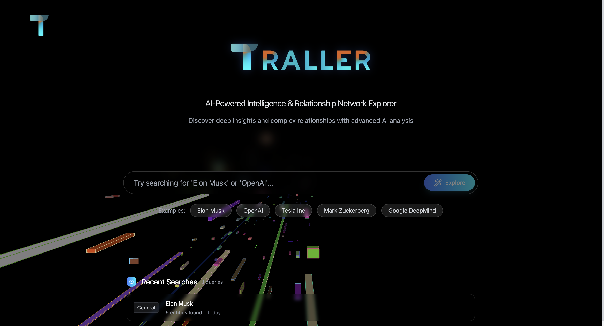

<div align="center">
  
  <p>一个可视化的智能研究代理</p>
</div>

<div align="center">
  
  
  
  
  
</div>

---

## 🚀 项目简介

你是否曾为了解一个人物、一个概念或一个事件，在无数个网页和文档中反复横跳，试图将碎片化的信息拼凑成完整的图像？我曾深陷其中，这正是 **Traller** 诞生的原因。

**Traller** 不仅仅是一个搜索引擎。它是一个智能研究代理，旨在将繁琐的信息搜集和整理工作，变成一次直观、可视化的探索之旅。你只需要输入一个关键词——比如一个人的名字——Traller 就会动用背后强大的语言模型（如 Gemini, Perplexity），为你挖掘相关信息，并自动梳理出核心实体与它们之间的复杂关系，最终以一张动态知识图谱清晰地呈现在你面前。

这个项目源于一个简单的想法：让获取知识的过程本身，也充满探索的乐趣。

### ✨ 核心功能

- **多AI引擎驱动**: 集成 `Kimi K2`, `Perplexity`, `Tavily` 等多种AI服务，从不同维度搜集和分析信息。
- **关系图谱可视化**: 自动提取关键实体（人物、组织、地点等），生成可交互的关系网络。
- **动态探索界面**: 基于 `React` 和 `p5.js`，提供富有生命力的可视化效果和流畅的交互体验。
- **稳定可扩展后端**: 基于 `NestJS` 构建，确保服务的高效与可靠。

## ⚠️ 潜在风险与道德考量

我们深知，信息聚合工具在带来便利的同时，也可能被滥用，甚至触及“人肉搜索”（开盒）的道德和法律红线。Traller 的设计初衷是提高 **公开信息** 的获取和整合效率，而非侵犯个人隐私。

因此，本项目在开发和未来迭代中，将严格遵守以下原则：

1.  **数据来源合法性**: Traller 只聚合和处理来自 **公开渠道**（如新闻网站、百科、公共数据库等）的信息。我们不会、也绝不会尝试获取任何非公开的个人数据。
2.  **目的限定性**: 项目的目的是辅助研究和学习，帮助用户理解事物之间的关联， **绝非** 提供用于骚扰、攻击他人的工具。
3.  **合规路线图**: 我们正在积极探索技术和产品层面的限制措施，例如通过算法识别并 **脱敏处理** 部分个人敏感信息，并对特定类型的查询加以限制。

我们致力于将 Traller 打造成一个负责任的、向善的工具，并欢迎社区就此提出建议，共同探讨技术的边界与未来。

## 🛠️ 技术栈

- **后端**: [NestJS](https://nestjs.com/), [TypeScript](https://www.typescriptlang.org/)
- **前端**: [React](https://react.dev/), [Vite](https://vitejs.dev/), [TypeScript](https://www.typescriptlang.org/), [Tailwind CSS](https://tailwindcss.com/), [p5.js](https://p5js.org/)
- **包管理器**: [pnpm](https://pnpm.io/)

## ⚡ 快速开始 (本地运行)

请确保您的开发环境中已安装 [Node.js](https://nodejs.org/) (v18 或更高版本) 和 [pnpm](https://pnpm.io/)。

### 1. 克隆仓库

```bash
git clone git@github.com:Awzs/Traller.git
cd Traller
```

### 2. 安装与启动

项目根目录下的 `start.sh` 脚本会自动处理所有依赖安装和服务启动。只需执行：

```bash
chmod +x ./start.sh
./start.sh
```

脚本将分别安装前端和后端的依赖，并以开发模式启动两个服务。

### 3. 访问项目

启动成功后，您可以通过以下地址访问：

- **🖥️ 前端应用**: `http://localhost:5173`
- **⚙️ 后端服务**: `http://localhost:3000`

## 🌐 部署到 Vercel

### 前置要求

1. 安装 [Vercel CLI](https://vercel.com/cli)：
   ```bash
   npm i -g vercel
   ```

2. 准备环境变量：
   - 复制 `.env.example` 为 `.env`
   - 填入必要的 API 密钥

### 快速部署

使用提供的部署脚本：

```bash
chmod +x ./deploy.sh
./deploy.sh
```

### 手动部署

1. 登录 Vercel：
   ```bash
   vercel login
   ```

2. 部署项目：
   ```bash
   vercel --prod
   ```

3. 在 Vercel 控制台配置环境变量：
   - `MONGODB_URI`: MongoDB 连接字符串
   - `PERPLEXITY_API_KEY`: Perplexity API 密钥
   - `TAVILY_API_KEY`: Tavily API 密钥
   - `OPENROUTER_API_KEY`: OpenRouter API 密钥

### 部署特性

- ✅ **自动缓存**: 实现了智能缓存机制，避免重复请求
- ✅ **流式响应**: 支持 Server-Sent Events，实时显示处理进度
- ✅ **超时处理**: 针对 Vercel 免费版时间限制进行优化
- ✅ **错误恢复**: 多重 API 服务备份，确保服务稳定性

## ☁️ 部署到 Google Cloud

### 前置要求

1. 安装 [Google Cloud SDK](https://cloud.google.com/sdk/docs/install)
2. 安装 [Docker](https://docs.docker.com/get-docker/)
3. 创建 Google Cloud 项目并启用计费

### 快速部署

使用自动化部署脚本：

```bash
# 设置项目ID
export GCP_PROJECT_ID="your-project-id"

# 完整部署（首次部署推荐）
./deploy-gcp.sh

# 或快速部署（适用于已配置环境）
./quick-deploy-gcp.sh
```

### 手动部署步骤

1. **配置 Google Cloud**:
   ```bash
   gcloud auth login
   gcloud config set project YOUR_PROJECT_ID
   gcloud services enable cloudbuild.googleapis.com run.googleapis.com
   ```

2. **构建和部署后端**:
   ```bash
   cd backend
   gcloud builds submit --tag gcr.io/YOUR_PROJECT_ID/traller-backend
   gcloud run deploy traller-backend \
     --image gcr.io/YOUR_PROJECT_ID/traller-backend \
     --platform managed \
     --region asia-east1 \
     --allow-unauthenticated
   ```

3. **构建和部署前端**:
   ```bash
   cd frontend
   gcloud builds submit --tag gcr.io/YOUR_PROJECT_ID/traller-frontend
   gcloud run deploy traller-frontend \
     --image gcr.io/YOUR_PROJECT_ID/traller-frontend \
     --platform managed \
     --region asia-east1 \
     --allow-unauthenticated
   ```

### 环境变量配置

在 Cloud Run 控制台或通过命令行配置以下环境变量：

**后端服务必需变量**:
- `NODE_ENV=production`
- `MONGODB_URI`: MongoDB 连接字符串
- `PERPLEXITY_API_KEY`: Perplexity API 密钥
- `TAVILY_API_KEY`: Tavily API 密钥
- `OPENROUTER_API_KEY`: OpenRouter API 密钥

**可选变量**:
- `FRONTEND_URL`: 前端服务URL（用于CORS配置）
- `ALLOWED_ORIGINS`: 允许的其他域名

### 生产环境特性

- ✅ **容器化部署**: 使用 Docker 多阶段构建优化镜像大小
- ✅ **自动扩缩容**: Cloud Run 根据流量自动调整实例数量
- ✅ **健康检查**: 内置健康检查端点 `/health`
- ✅ **优雅关闭**: 支持 SIGTERM/SIGINT 信号处理
- ✅ **日志聚合**: 所有日志输出到 stdout/stderr，由 Cloud Logging 收集
- ✅ **安全配置**: 非 root 用户运行，最小权限原则

## 📸 项目截图



## 🤝 贡献指南

我们非常欢迎来自社区的贡献！如果您有任何好的想法或发现了 Bug，请随时通过以下方式参与：

- **提交 Issue**: 报告 Bug 或提出功能建议。
- **提交 Pull Request**: 改进代码、添加新功能或修复问题。

我们期待您的参与！

## 📄 许可证

本项目基于 MIT License 开源。
